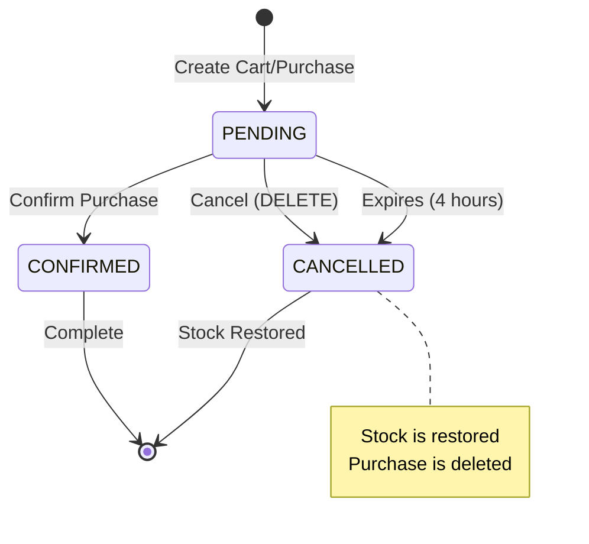

Cancels a purchase and restores the reserved product stock. This is the recommended way to cancel an order or let an expired purchase clean up its stock reservation.

<Warning>
  This operation is permanent and cannot be undone. Stock will be restored to the products.
</Warning>

## Authentication

This endpoint requires a valid Bearer token in the Authorization header.

<ParamField path="id" type="integer" required>
  The unique identifier of the purchase to cancel
</ParamField>

## Request Headers

<ParamField header="Authorization" type="string" required>
  Bearer token for authentication
  
  Example: `Bearer eyJhbGciOiJIUzI1NiIsInR5cCI6IkpXVCJ9...`
</ParamField>

## Response

Returns a success message with the cancelled purchase ID.

<ResponseField name="message" type="string">
  Confirmation message: "Compra eliminada correctamente. ID: {id}"
</ResponseField>

## Status Codes

- **200 OK** - Purchase cancelled and stock restored successfully
- **401 Unauthorized** - Invalid or missing authentication token, or user session is not active

## What Happens When You Cancel

1. **Stock Restoration**: All products in the cart have their stock quantities restored
2. **Purchase Deletion**: The purchase record is removed from the database
3. **No Event Emission**: Cancellation does not emit Kafka events (to avoid duplicates)
4. **Cascade Effects**: The associated cart may be deleted depending on database constraints

<CodeGroup>
```bash cURL
curl -X DELETE "https://api.example.com/purchase/42" \
  -H "Authorization: Bearer YOUR_TOKEN_HERE"
```

```javascript JavaScript
const response = await fetch('https://api.example.com/purchase/42', {
  method: 'DELETE',
  headers: {
    'Authorization': 'Bearer YOUR_TOKEN_HERE'
  }
});

const result = await response.json();
console.log(result); // "Compra eliminada correctamente. ID: 42"
```

```python Python
import requests

response = requests.delete(
    'https://api.example.com/purchase/42',
    headers={'Authorization': 'Bearer YOUR_TOKEN_HERE'}
)

result = response.json()
print(result)  # "Compra eliminada correctamente. ID: 42"
```
</CodeGroup>

## Example Response

```json
"Compra eliminada correctamente. ID: 42"
```

## Purchase Lifecycle



## Stock Restoration Process

When a purchase is cancelled, the system:

1. Retrieves the associated cart
2. For each cart item:
   - Gets the product
   - Adds the reserved quantity back to product stock
   - Updates the product in the database
3. Deletes the purchase record

### Example

If a cart contained:
- 2x Wireless Headphones (stock was 48, becomes 50)
- 1x USB-C Cable (stock was 199, becomes 200)

After cancellation, both products have their stock restored to original levels.

## Common Use Cases

### User Cancels Order
```javascript
// User decides not to complete purchase
await fetch(`https://api.example.com/purchase/${purchaseId}`, {
  method: 'DELETE',
  headers: { 'Authorization': `Bearer ${token}` }
});
```

### Automatic Expiration
```javascript
// Check for expired purchases (older than 4 hours)
const response = await fetch('https://api.example.com/purchase/pending-cart', {
  headers: { 'Authorization': `Bearer ${token}` }
});

if (response.status === 404) {
  console.log('No pending purchase (may have expired)');
}
```

### Clean Up Failed Payment
```javascript
try {
  await processPayment(purchaseId);
} catch (error) {
  // Payment failed, cancel purchase and restore stock
  await fetch(`https://api.example.com/purchase/${purchaseId}`, {
    method: 'DELETE',
    headers: { 'Authorization': `Bearer ${token}` }
  });
}
```

## Important Notes

- **Stock Restoration**: This is the ONLY way to restore stock for a purchase (deleting the cart directly does not restore stock)
- **4-Hour Rule**: Purchases automatically expire after 4 hours if not confirmed
- **Idempotent**: Safe to call even if the purchase doesn't exist (will still return 200)
- **No Rollback**: Cannot undo a cancellation
- **Confirmed Purchases**: Can still be cancelled, but stock restoration may not be desired for confirmed orders

## Comparison: DELETE /cart vs DELETE /purchase

| Operation | Stock Restored? | Use Case |
|-----------|----------------|----------|
| `DELETE /cart/{id}` | ❌ No | Administrative cleanup |
| `DELETE /purchase/{id}` | ✅ Yes | Cancel order, restore stock |

<Warning>
  Always use `DELETE /purchase/{id}` when you want to cancel an order properly. Using `DELETE /cart/{id}` will NOT restore stock.
</Warning>

## See Also

- [Get Purchase](/api/orders/get) - GET /purchase/{id}
- [Create Purchase](/api/orders/create) - POST /purchase
- Confirm Purchase - POST /purchase/{id}/confirm/{addressId} (not yet documented)
- [Delete Cart](/api/cart/remove-item) - DELETE /cart/{id} (does NOT restore stock)