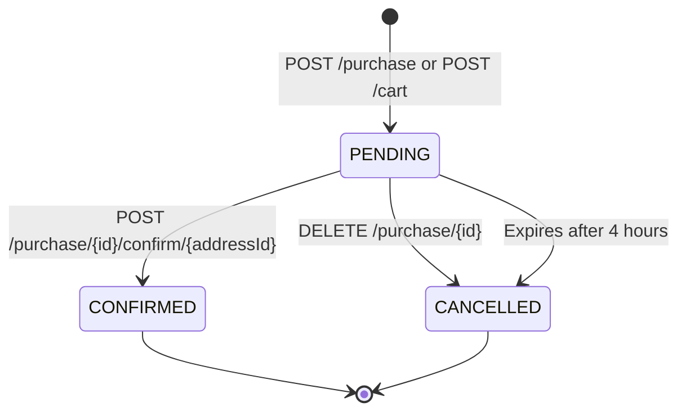

Creates a new purchase order. This endpoint is typically used for direct purchase creation, though most carts are created via the `POST /cart` endpoint which automatically generates a purchase.

<Info>
  In most cases, you should use `POST /cart` instead, which creates both a cart and a purchase in a single operation with stock validation.
</Info>

## Authentication

This endpoint requires a valid Bearer token in the Authorization header.

## Request Headers

<ParamField header="Authorization" type="string" required>
  Bearer token for authentication
  
  Example: `Bearer eyJhbGciOiJIUzI1NiIsInR5cCI6IkpXVCJ9...`
</ParamField>

## Request Body

<ParamField body="cart" type="object" required>
  Cart object to associate with the purchase
  
  <ParamField body="id" type="integer" required>
    ID of an existing cart
  </ParamField>
</ParamField>

<ParamField body="date" type="string">
  Purchase date (ISO 8601 format). If not provided, current time will be used.
</ParamField>

<ParamField body="reservationTime" type="string">
  Stock reservation time (ISO 8601 format). If not provided, current time will be used.
</ParamField>

<ParamField body="direction" type="string">
  Delivery address. Can be set later via confirm endpoint.
</ParamField>

## Response

<ResponseField name="id" type="integer">
  Purchase ID
</ResponseField>

<ResponseField name="date" type="string">
  Purchase creation date (ISO 8601 format)
</ResponseField>

<ResponseField name="reservationTime" type="string">
  Time when the stock reservation was made
</ResponseField>

<ResponseField name="status" type="string">
  Purchase status - automatically set to "PENDING"
  
  Possible values:
  - `PENDING` - Purchase created, stock reserved, awaiting confirmation
  - `CONFIRMED` - Purchase confirmed, payment processed
  - `CANCELLED` - Purchase cancelled, stock restored
</ResponseField>

<ResponseField name="direction" type="string" nullable>
  Delivery address
</ResponseField>

<ResponseField name="cart" type="object">
  Associated cart details (simplified reference)
</ResponseField>

## Status Codes

- **200 OK** - Purchase created successfully
- **401 Unauthorized** - Invalid or missing authentication token, or user session is not active

<CodeGroup>
```bash cURL
curl -X POST "https://api.example.com/purchase" \
  -H "Authorization: Bearer YOUR_TOKEN_HERE" \
  -H "Content-Type: application/json" \
  -d '{
    "cart": {
      "id": 38
    },
    "direction": "123 Main St, City, Country"
  }'
```

```javascript JavaScript
const response = await fetch('https://api.example.com/purchase', {
  method: 'POST',
  headers: {
    'Authorization': 'Bearer YOUR_TOKEN_HERE',
    'Content-Type': 'application/json'
  },
  body: JSON.stringify({
    cart: { id: 38 },
    direction: '123 Main St, City, Country'
  })
});

const purchase = await response.json();
console.log(purchase);
```

```python Python
import requests

response = requests.post(
    'https://api.example.com/purchase',
    headers={
        'Authorization': 'Bearer YOUR_TOKEN_HERE',
        'Content-Type': 'application/json'
    },
    json={
        'cart': {'id': 38},
        'direction': '123 Main St, City, Country'
    }
)

purchase = response.json()
print(purchase)
```
</CodeGroup>

## Example Response

```json
{
  "id": 42,
  "date": "2026-03-13T10:30:00",
  "reservationTime": "2026-03-13T10:30:00",
  "status": "PENDING",
  "direction": "123 Main St, City, Country",
  "cart": {
    "id": 38
  }
}
```

## Purchase States



### PENDING
- Initial state when purchase is created
- Stock is reserved but not confirmed
- Purchase expires after 4 hours
- Stock is restored if expired or cancelled

### CONFIRMED
- Purchase has been paid and confirmed
- Stock reservation is permanent
- Cannot be cancelled (stock won't be restored)
- Final state

### CANCELLED
- Purchase was explicitly cancelled
- Stock is restored to products
- Final state

## Important Notes

- **User Association**: The purchase is automatically associated with the authenticated user (extracted from JWT token)
- **Status Override**: The `status` field in the request body is ignored and always set to `PENDING`
- **Recommended Flow**: Use `POST /cart` instead, which handles cart creation, validation, and purchase generation in one atomic operation
- **No Event Emission**: This endpoint does not emit Kafka events to avoid duplicates (events are emitted from cart creation)
- **No Stock Validation**: Unlike `POST /cart`, this endpoint does not validate stock availability

## See Also

- [Create Cart](/api/cart/add-item) - POST /cart (recommended for creating purchases with carts)
- Confirm Purchase - POST /purchase/{id}/confirm/{addressId} (not yet documented)
- [Get Purchase](/api/orders/get) - GET /purchase/{id}
- [Cancel Purchase](/api/orders/cancel) - DELETE /purchase/{id}